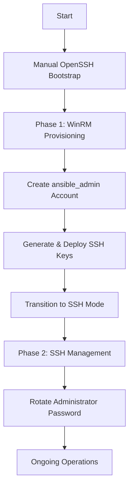

# Dual-Mode Provisioning Guide

## Overview

The Tailnet Automation system uses a two-phase provisioning approach for Windows hosts:

1. **Phase 1: Initial Provisioning (WinRM)** - One-time setup using Windows modules
2. **Phase 2: Ongoing Management (SSH)** - Long-term management with SSH key authentication

This approach provides the best of both worlds: Windows module compatibility during setup and secure SSH-based management for ongoing operations.

## Why Dual-Mode?

### WinRM Mode (Initial Provisioning)
- **Purpose**: Windows-specific modules require WinRM
- **Modules**: `win_user`, `win_share`, `win_acl`, `win_firewall_rule`
- **Duration**: 15-30 minutes (one-time)
- **Authentication**: Administrator account with password
- **Port**: 5985 (HTTP) or 5986 (HTTPS)

### SSH Mode (Ongoing Management)
- **Purpose**: Cross-platform consistency and security
- **Authentication**: SSH key-based (no passwords)
- **Port**: 22 (standard SSH)
- **Benefits**: 
  - No password exposure
  - Audit trail via SSH logs
  - Standard tooling across platforms
  - Better security posture

## Provisioning Workflow



## Step-by-Step Transition Guide

### Prerequisites

Before starting the transition, ensure:

- [ ] Initial provisioning completed via WinRM
- [ ] OpenSSH installed and running on Windows
- [ ] `ansible_admin` account created
- [ ] Tailscale connected and accessible
- [ ] Vault password available

### Step 1: Verify Current State

Check that you're currently in WinRM mode:

```bash
# View current configuration
cat inventory/group_vars/windows_group.yml | grep ansible_connection

# Should show: ansible_connection: winrm
```

### Step 2: Generate and Deploy SSH Keys

Run the SSH key management playbook:

```bash
ansible-playbook playbooks/setup-ssh-keys.yml -i inventory/hosts.ini --ask-vault-pass
```

This will:
- Generate ed25519 SSH key pair
- Deploy public key to `ansible_admin` account
- Verify SSH connectivity
- Clean up temporary private keys

The permanent private key will be stored at `~/.ssh/ansible_admin_key`.

### Step 3: Test SSH Connectivity

Before transitioning, verify SSH works:

```bash
# Test SSH connection manually
ssh -i ~/.ssh/ansible_admin_key ansible_admin@<windows-host-ip> "echo SSH works"

# Should output: SSH works
```

### Step 4: Run Transition Playbook

Execute the automated transition:

```bash
ansible-playbook playbooks/transition-to-ssh.yml -i inventory/hosts.ini --ask-vault-pass
```

The playbook will:
1. Verify WinRM connectivity (current mode)
2. Test SSH connectivity (target mode)
3. Backup current configuration
4. Switch to SSH configuration
5. Validate new SSH connectivity

### Step 5: Verify SSH Mode

Test that Ansible now uses SSH:

```bash
# Test connectivity
ansible windows_group -i inventory/hosts.ini -m ping

# Run preflight checks
ansible-playbook playbooks/preflight-checks.yml -i inventory/hosts.ini
```

### Step 6: Security Hardening

After successful transition, rotate the Administrator password:

```bash
# Generate new password (outside Ansible)
openssl rand -base64 32

# Change password on Windows (via SSH)
ssh -i ~/.ssh/ansible_admin_key ansible_admin@<windows-host-ip>
# Then in PowerShell:
# net user Administrator <new-password>

# Remove old password from vault.yml
ansible-vault edit vars/vault.yml
# Delete vault_windows_admin_password entry
```

## Configuration Files

### WinRM Configuration
File: `inventory/group_vars/windows_group_winrm.yml`

```yaml
ansible_connection: winrm
ansible_user: Administrator
ansible_password: "{{ vault_windows_admin_password }}"
ansible_port: 5985
provisioning_mode: "winrm"
```

### SSH Configuration
File: `inventory/group_vars/windows_group_ssh.yml`

```yaml
ansible_connection: ssh
ansible_user: ansible_admin
ansible_ssh_private_key_file: ~/.ssh/ansible_admin_key
ansible_port: 22
provisioning_mode: "ssh"
```

### Active Configuration
File: `inventory/group_vars/windows_group.yml`

This file is the active configuration. It starts as a copy of `windows_group_winrm.yml` and transitions to `windows_group_ssh.yml` content.

## Rollback Procedure

If you need to revert to WinRM mode:

```bash
# Restore WinRM configuration
cp inventory/group_vars/windows_group_winrm.yml inventory/group_vars/windows_group.yml

# Test WinRM connectivity
ansible windows_group -i inventory/hosts.ini -m win_ping --ask-vault-pass
```

## Troubleshooting

### SSH Connection Refused

**Symptom**: `Connection refused` when testing SSH

**Solutions**:
1. Verify OpenSSH service is running:
   ```powershell
   Get-Service sshd
   Start-Service sshd
   ```

2. Check firewall rules:
   ```powershell
   Get-NetFirewallRule -Name "*ssh*"
   ```

3. Verify Tailscale connectivity:
   ```bash
   tailscale status
   ```

### Permission Denied (publickey)

**Symptom**: `Permission denied (publickey)` error

**Solutions**:
1. Verify public key is deployed:
   ```powershell
   Get-Content C:\Users\ansible_admin\.ssh\authorized_keys
   ```

2. Check authorized_keys permissions:
   ```powershell
   icacls C:\Users\ansible_admin\.ssh\authorized_keys
   # Should show: SYSTEM:(F), ansible_admin:(F)
   ```

3. Verify private key permissions:
   ```bash
   ls -la ~/.ssh/ansible_admin_key
   # Should show: -rw------- (600)
   ```

### WinRM Still Active After Transition

**Symptom**: Ansible still uses WinRM after transition

**Solutions**:
1. Verify active configuration:
   ```bash
   cat inventory/group_vars/windows_group.yml | grep ansible_connection
   ```

2. Clear Ansible cache:
   ```bash
   rm -rf ~/.ansible/cp/
   ```

3. Re-run transition playbook:
   ```bash
   ansible-playbook playbooks/transition-to-ssh.yml -i inventory/hosts.ini --ask-vault-pass
   ```

## Security Best Practices

### SSH Key Management

1. **Never commit private keys** to version control
2. **Use strong key types**: ed25519 or RSA 4096-bit
3. **Rotate keys periodically**: Re-run `setup-ssh-keys.yml` to regenerate
4. **Protect private keys**: Store with 600 permissions
5. **Use key passphrases**: For additional security (optional)

### Password Management

1. **Rotate Administrator password** after transition
2. **Use strong passwords**: 32+ characters, random
3. **Store securely**: Use password manager (1Password, LastPass, etc.)
4. **Remove from vault**: Delete `vault_windows_admin_password` after rotation
5. **Document location**: Note where Administrator password is stored

### Access Control

1. **Limit SSH access**: Only `ansible_admin` and `@TeamShare` group
2. **Disable password auth**: SSH keys only (no password fallback)
3. **Restrict firewall**: SSH only from Tailscale network (100.64.0.0/10)
4. **Monitor access**: Review SSH logs regularly
5. **Audit accounts**: Verify only authorized users have access

## Maintenance

### Regular Tasks

**Monthly**:
- Review SSH access logs
- Verify firewall rules
- Test SSH connectivity

**Quarterly**:
- Rotate SSH keys
- Review user accounts
- Update OpenSSH version

**Annually**:
- Full security audit
- Disaster recovery test
- Documentation review

### SSH Key Rotation

To rotate SSH keys:

```bash
# Generate new keys
ansible-playbook playbooks/setup-ssh-keys.yml -i inventory/hosts.ini --ask-vault-pass

# Test new keys
ansible windows_group -i inventory/hosts.ini -m ping

# Old keys are automatically replaced
```

## Reference

### Related Playbooks

- `playbooks/setup-openssh-bootstrap.yml` - Initial OpenSSH setup
- `playbooks/setup-ssh-keys.yml` - SSH key generation and deployment
- `playbooks/transition-to-ssh.yml` - WinRM to SSH transition
- `playbooks/preflight-checks.yml` - Connectivity validation

### Related Roles

- `roles/openssh_setup_windows/` - OpenSSH installation and configuration
- `roles/ssh_key_management/` - SSH key lifecycle management
- `roles/windows_users/` - User account management (includes ansible_admin)

### Configuration Files

- `inventory/group_vars/windows_group.yml` - Active configuration
- `inventory/group_vars/windows_group_winrm.yml` - WinRM template
- `inventory/group_vars/windows_group_ssh.yml` - SSH template
- `vars/vault.yml` - Encrypted credentials

## Support

For issues or questions:

1. Check troubleshooting section above
2. Review Ansible logs: `ansible.log`
3. Verify requirements in `requirements.md`
4. Consult design document: `design.md`
